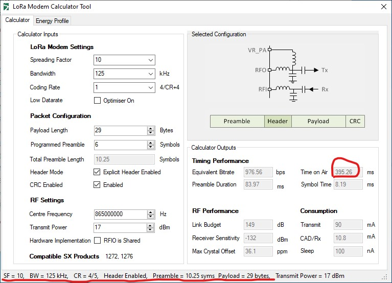

## SX1276
MicroPython Library for SX1276 LoRa radio modem 
## Features 
* Send request, ask for response from a specified recipient, and broadcast. 
* Implement FHSS (first?)
  * FCC mandates frequency hopping if dwell time is above the threshold 400ms.  
  * Large spreading factor and narrow bandwidth can significantly prolong the dwell time so that freq hopping is necessary for transmiiting large packet.
## My dev environment
* Two ESP32 with SX1276 (Heltec WiFi LoRa 32 V2)
* VScode with Pico-Go extension 
* I configured project and global settings <i>pico-go.json</i> for Pico-Go ext so I can open two VScode window/instances and connect to two ESP32 boards simultanously
## Usage
* Connect two boards to dev machine
* Open sender and receiver folders in two separate VScode windows.
* Upload lora.py to boards 
* Run sender.py and receiver.py
## FHSS
* To prove the point of frequency hopping, I use the RTL-SDR to monitor the spectrum. In following waterfall diagram, we see the signal hops between 914 and 916MHz as I programmed it to be.
</img>
* FHSS is not necessary if the message is short. For example, a 29Bytes packet can be transmitted under 400ms, given parameters {SF:10, BW:125kHz, CR:4/5, Header: Explicit , Preamble: 6}. 
</img>
## Note
* It is meaningless to do Channel Activity Detection (CAD) before Tx because SX1276 only match elusive preambles which last few milliseconds. No good solution to do Listen Before Talk or CSMA. 
