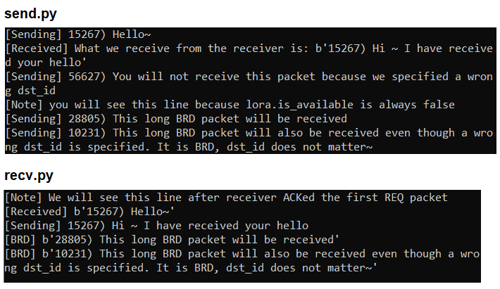
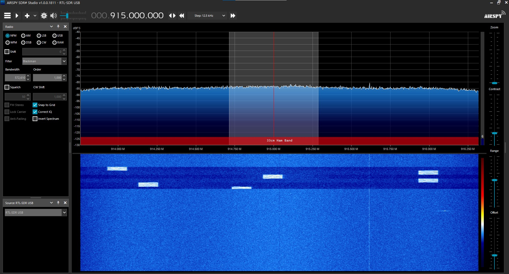

This repo implements more than basic SX1276 operations while [Learn_SX1276](https://github.com/xg590/Learn_SX1276) shows all the basics. 
## SX1276
MicroPython Library for SX1276 LoRa radio modem 
## Features 
* MAC layer (half-duplex). 
  * One SX1276 can send a "REQ" packet (in a blocking way) and expect a specified SX1276 to respond with an "ACK" packet. This process is handled by this library.
  * One SX1276 can send a "BRD" packet (in a non-blocking way) and expect no "ACK" reply.
* Implement FHSS (first?)
  * FCC mandates frequency hopping if dwell time is above the threshold 400ms.
  * Large spreading factor and narrow bandwidth can significantly prolong the dwell time so that freq hopping is necessary for transmiiting large packet.
## Usage 
* Upload lora.py to MCUs (Heltec WiFi LoRa 32 V2)
* Run [sender.py](sender/sender.py) and [receiver.py](receiver/receiver.py) on two separate MCUs
## My dev environment
* Two MCUs with SX1276 (ESP32: Heltec WiFi LoRa 32 V2)
* Flash MCUs with MicroPython
* Connect two MCUs to a Linux Machine with VSCode via USB
* Install Pico-W-Go extension for VSCode
* Open sender/receiver folders in two VSCode windows
* Configure sender/receiver projects for Pico-W-Go
* Specify the "Manual Com Device" in Pico-W-Go and restart the Pico-W-Go
* Play with Pico-W-Go commands
## Console Output of sample code
</img>
## FHSS
* To prove the point of frequency hopping, I use a RTL-SDR to monitor the spectrum. In following waterfall diagram, we see the signal hops between 914 and 916MHz as I programmed it to be.
</img>
* FHSS is not necessary if the message is short. For example, a 29Bytes packet can be transmitted under 400ms, given parameters {SF:10, BW:125kHz, CR:4/5, Header: Explicit , Preamble: 6}. 
</img> 
Download the above air time [calculator](misc/airtime_calculator.zip)

## Note
* FHSS feature can be turned off by only specifying one frequency in channels2Hopping / FHSS_list.
* It is meaningless to do Channel Activity Detection (CAD) before Tx because SX1276 only match elusive preambles which last few milliseconds. No good solution to do Listen Before Talk or CSMA.